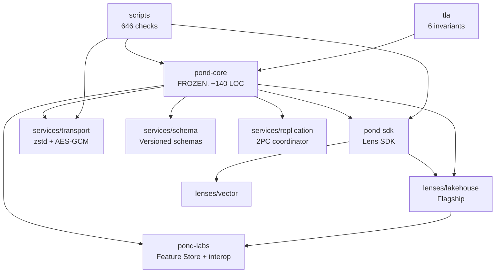

# Pond Knowledge Graph

> **The navigational map of the entire repository.** Every active
> file, every concept, every relationship. **Maintain this file
> whenever the repo changes.**
>
> **Purpose:** Any agent (human or AI) can read this file and have
> complete knowledge of what's in the repo, where it lives, and how
> it connects. Never let this file go stale.
>
> **Maintenance protocol:** See §6. Update this file on every commit
> that adds, removes, moves, or renames a file.

---

## 0. How to use this file

1. **New to Pond?** Read §1 (architecture overview) and §2 (file map).
2. **Looking for a specific file?** Use §2 (file map) or §3 (concept map).
3. **Want to understand relationships?** Read §4 (dependency graph).
4. **Writing a new Lens?** Read §5 (Lens roadmap) and `docs/LENS_GUIDE.md`.
5. **Maintaining this file?** Read §6 (maintenance protocol).

---

## 1. Architecture Overview

```
┌─────────────────────────────────────────────────────────────────┐
│ Applications (SQL, Git, Feature Store, Notebook, Lakehouse)     │
├─────────────────────────────────────────────────────────────────┤
│ Lenses (encode/decode; interpretation layer)                    │
│  • lenses/lakehouse/  • lenses/vector/                          │
│  • archive/pond-sql/  • archive/pond-git/  (reference impls)    │
├─────────────────────────────────────────────────────────────────┤
│ Services (cross-cutting; between kernel and lenses)             │
│  • services/transport/  • services/schema/  • services/replication/ │
├─────────────────────────────────────────────────────────────────┤
│ SDK (PondLens base, KeyValueLens, ProllyTreeIndex, indexes, query) │
│  • pond-sdk/                                                    │
├─────────────────────────────────────────────────────────────────┤
│ Kernel (FROZEN; 3 operations; ~140 LOC)                         │
│  • pond-core/kernel.py                                    │
├─────────────────────────────────────────────────────────────────┤
│ Backend (local disk, S3, IPFS, FDB — pluggable)                 │
└─────────────────────────────────────────────────────────────────┘
```

**The 7 design principles** (see `DESIGN_GOALS.md` §3):
Simple, Powerful, Performant, Scalable, Efficient, Beautiful, Functional.

**The 3 kernel operations**: `Write(bytes)→hash`, `Read(hash)→bytes`,
`Ref(name,hash)→()`.

**The 6 substrates**: Bytes, Names, Time, Coordination, Range-Read, Key.

**The 17 formal algebras** (see `docs/POND_FORMAL_ALGEBRAS.md`):
Reference, Merge, GC, RTT, OSN, Physical Structure, Workspace, History,
Substrate, Manifest, Range Read, State-vs-Bytes, GC-with-Packs, PS Dep
Graph, Concurrency, Replication, Transport, Schema Evolution.

---

## 2. File Map (every active file)

### 2.1 pond-core/ (Kernel — FROZEN)

| File | LOC | Purpose |
|---|---|---|
| `pond-core/kernel.py` | 199 | The kernel. `PondMinimal` class with `write()`, `read()`, `reference()`, `resolve()`, `list_names()`. SQLite-backed root namespace. |
| `pond-core/__init__.py` | 0 | Package marker. |
| `pond-core/README.md` | 43 | Folder purpose and usage. |

### 2.2 pond-sdk/ (Lens SDK — 14 files, ~7300 LOC)

| File | LOC | Exports | Purpose |
|---|---|---|---|
| `pond-sdk/base_lens.py` | 248 | `PondLens` | **Shared namespace base for ALL Lenses.** Provides only ref-namespace operations (branch, list_collections, set_definition, get_definition, history). No format awareness — each app-facing lens owns its own read/write API. |
| `pond-sdk/prolly_tree.py` | 764 | `ProllyTree`, `ProllyLensBase` | ProllyTreeIndex storage + tiered commits (delta + snapshot) + branching + merge + history. The universal storage backend for all collections. |
| `pond-sdk/collection.py` | 517 | `Collection` | Named collection with namespace, type, source metadata. |
| `tests/lens_algebra/lens_laws.py` | 591 | (test harness) | RFC-0007 Lens algebra property tests (6 laws). |
| `tests/architecture/architecture_laws.py` | 557 | (12 laws) | Executable architecture laws (Identity, Reachability, History, Lens, Derived, Branch, Merge, Determinism, Scale, Index). |
| `pond-sdk/binary_encoding.py` | 323 | `BinaryProllyTree` | Binary Prolly tree encoding (metadata optimization). |
| `tests/integration/test_shared_lenses.py` | 442 | (tests) | Test: multiple KeyValueLens subclasses sharing same byte graph. |
| `tests/integration/test_lens_architecture.py` | 449 | (tests) | Test: multi-Lens architecture proof (SQL/Git/Notebook lenses over same byte graph). |
| `pond-sdk/row_query.py` | 288 | `LensQuery`, `JoinedQuery` | Lazy query API: `.where()`, `.select()`, `.map()`, `.join()`, `.collect()`. |
| `tests/integration/test_lens_query.py` | 327 | (tests) | Test: LensQuery. |
| `tests/integration/test_pruning.py` | 320 | (tests) | Test: Vortex-style pruning. Zone-map-based pruning works for JSON, Parquet, and custom formats. |
| `tests/integration/test_lakehouse_pruning.py` | 130 | (tests) | Test: End-to-end pruning with LakehouseLens. Zone maps auto-built at write time, read_with_pruning skips row groups. |
| `tests/integration/test_kv_pruning_and_projection.py` | 130 | (tests) | Test: KV pruning + Lakehouse projection pushdown. Zone maps for KV, column-level access for Parquet. |
| `tests/integration/test_collection_metadata.py` | 120 | (tests) | Test: Collection integration — unified namespace + labels + zone maps + indexes + pruning + compaction. |
| `pond-sdk/maintenance.py` | 315 | `drop_name`, `is_dropped`, `resolve_active`, `compact_tombstones` | Tombstone helpers (RFC-0008: deletion as data). |
| `pond-sdk/collection_metadata.py` | 343 | `CollectionMetadata` | Data-side metadata manager. Manages zone maps, indexes, and (future) bloom filters for collections. Lens-agnostic — works through callbacks. |
| `pond-sdk/uuid7.py` | 180 | `uuidv7`, `uuidv7_monotonic`, `uuidv7_timestamp` | UUIDv7 time-ordered UUID generation for distributed row identification (_rowid). |
| `tests/lens_algebra/run_lens_laws_ci.py` | 267 | (CI runner) | CI runner for Lens contracts. |
| `pond-sdk/__init__.py` | 0 | Package marker. |
| `pond-sdk/README.md` | 52 | Folder purpose and usage. |
| `pond-sdk/extensions/__init__.py` | 55 | `register_extension`, `list_extensions` | Extension registry. |
| `pond-sdk/extensions/indexing/__init__.py` | 27 | `CollectionIndexer`, `AutoIndexMixin`, `AutoIndex` | Indexing extension package. Collection-level indexing + legacy lens-mixin approach. |
| `pond-sdk/extensions/indexing/collection_index.py` | 200 | `CollectionIndexer` | Collection-level indexer. Operates on kernel + collection name. Any lens can use it. Indexes belong to collections (data-side), not lenses. |
| `pond-sdk/extensions/indexing/base.py` | 80 | `CollectionIndexerInterface` | Abstract interface for collection-level indexers. |
| `pond-sdk/extensions/semantic/__init__.py` | 15 | — | Semantic extension package. |
| `pond-sdk/extensions/semantic/base.py` | 45 | `SemanticModelAdapter` | Abstract interface for semantic adapters. |
| `pond-sdk/extensions/semantic/ossie.py` | 300 | `SemanticLens`, `OssieAdapter` | Ossie adapter + pluggable SemanticLens. |
| `pond-sdk/extensions/physical_structures/pruning.py` | 180 | `ZoneMap`, `PruningPredicate`, `ColumnPredicate` | Vortex-style predicate pushdown. Zone maps (min/max/null_count per row group) + pruning predicates. Skip row groups without decoding. |
| `pond-sdk/extensions/physical_structures/zone_map_index.py` | 280 | `ZoneMapIndex` | ProllyTreeIndex of zone maps. Stores min/max/null_count per data blob. Enables Vortex-style pruning without decoding. |
| `pond-sdk/extensions/physical_structures/pruning_reader.py` | 200 | `PruningReader` | Generic pruning reader. Reads zone maps first, skips non-matching data blobs without decoding. Works with ANY lens/format. |
| `pond-sdk/extensions/physical_structures/__init__.py` | 52 | — | Physical Structure extension package. |
| `pond-sdk/extensions/physical_structures/base.py` | 105 | `PhysicalStructure` | Abstract base: build, load, exists, delete, query. |
| `pond-sdk/extensions/physical_structures/bloom_filter.py` | 120 | `BloomFilter` | Probabilistic membership test (O(1)). |
| `pond-sdk/extensions/physical_structures/statistics.py` | 100 | `Statistics` | Column min/max/null_count for pruning. |
| `pond-sdk/extensions/physical_structures/zone_map.py` | 90 | `ZoneMap` | Per-chunk min/max for range pruning. |

### 2.3 lenses/ (Active Lens implementations — 3 packages)

| File | LOC | Exports | Purpose |
|---|---|---|---|
| `lenses/keyvalue/__init__.py` | 0 | — | Package marker. |
| `lenses/keyvalue/keyvalue_lens.py` | 694 | `KeyValueLens`, `KeylessLens`, `CrossLens`, `Lens`/`View` (aliases) | **App-facing KEY-VALUE lens** with ProllyTreeIndex backing. Per-row key→blob storage, O(log N) point lookups, branching, merge, history. `Lens = KeyValueLens` and `View = KeyValueLens` are backward-compat aliases. |
| `lenses/lakehouse/lakehouse_lens.py` | 886 | `LakehouseLens`, `PondLakehouse` | **Flagship.** DuckDB lakehouse: CREATE TABLE, INSERT, SELECT, time travel, branching, merge, schema evolution. Owns its Parquet I/O directly (not inherited). Adds range_read/range_write/range_point_lookup as Lakehouse-specific extensions on top of the shared ProllyTreeIndex. |
| `lenses/vector/vector_lens.py` | 198 | `VectorLens` | Vector DB with ANN search. Extends `IndexedLens`. |
| `lenses/vector/auto_index.py` | 329 | (mock) | Mock auto-index for testing. |
| `lenses/vector/mock_kernel.py` | 46 | `PondMinimal` (mock) | In-memory mock kernel for tests. |
| `lenses/vector/view_sdk.py` | 39 | `CrossLens` (mock) | Mock CrossLens helpers. |
| `lenses/vector/test_vector.py` | 175 | (tests) | VectorView tests. |
| `lenses/README.md` | — | — | Folder purpose, how to add a Lens. |

### 2.4 services/ (Cross-cutting services — 3 packages)

| File | LOC | Exports | Purpose |
|---|---|---|---|
| `services/transport/transport.py` | 363 | `KeyStore`, `TransportLayer` | Reference Transport Layer (zlib + XOR). §17 algebra. |
| `services/transport/transport_production.py` | 404 | `ProductionKeyStore`, `ProductionTransportLayer` | Production Transport (zstd + AES-GCM). |
| `services/transport/__init__.py` | 4 | — | Package marker. |
| `services/schema/schema_registry.py` | 412 | `SchemaRegistry`, `json_decoder_factory`, `json_encoder_factory` | Versioned schemas, backward/forward compat, migration. §18 algebra. |
| `services/schema/__init__.py` | 4 | — | Package marker. |
| `services/replication/replication_coordinator.py` | 537 | `PrimarySecondaryCoordinator`, `TwoPhaseCommitCoordinator` | Replication (§16) + 2PC coordinator (A7 escape hatch). |
| `services/replication/__init__.py` | 7 | — | Package marker. |
| `services/README.md` | — | — | Folder purpose. |

### 2.5 pond-labs/ (Experiments and demos — 4 files)

| File | LOC | Exports | Purpose |
|---|---|---|---|
| `pond-labs/lenses/feature_store_lens.py` | 584 | `FeatureStoreLens` | Versioned ML feature store: point-in-time joins, online/offline serving, schema evolution, branching. |
| `pond-labs/demos/interop_demo.py` | 359 | (demo) | **Killer demo:** bidirectional Feature Store ↔ Lakehouse interop (12/12 pass). |
| `pond-labs/benchmarks/loc_benchmark.py` | 469 | (benchmark) | LOC saved: 81% reduction (120 → 23 LOC) vs building from scratch. |
| `pond-labs/benchmarks/pruning_benchmark.py` | 200 | (benchmark) | Benchmark: Vortex-style pruning effectiveness. 100K rows, measures blob skip rate and speedup for 1-50% selectivity queries. |
| `pond-labs/benchmarks/overhead_audit.py` | 330 | (benchmark) | Overhead audit: zone map cost for OLTP, OLAP, streaming, point lookups, full scans, binary data. |
| `pond-labs/benchmarks/sql_pushdown_benchmark.py` | 95 | (benchmark) | SQL pushdown benchmark: pruned vs full scan on 100K rows. Shows Python pruning overhead vs DuckDB native scan on local disk. |
| `pond-labs/README.md` | — | — | Folder purpose. |

### 2.5b pond-lab/ (Lab experiments — 14 files)

| File | LOC | Exports | Purpose |
|---|---|---|---|
| `pond-labs/tracks/track1_compat_matrix.py` | 340 | (tests) | **Track 1:** Bidirectional Lens compatibility matrix (10/10 pass). Level 1 cert. |
| `pond-labs/tracks/track2_index_portability.py` | 380 | (tests) | **Track 2:** Index portability (18/18 pass). Level 2 cert. |
| `pond-labs/tracks/track3_lens_vs_opponent.py` | 460 | (benchmarks) | **Track 3:** Lens-vs-opponent benchmarks. |
| `pond-labs/tracks/track4_object_store_efficiency.py` | 480 | (tests) | **Track 4:** Object-store efficiency (7 experiments; packing = 204x reduction). |
| `pond-labs/tracks/track5_lens_composability.py` | 380 | (tests) | **Track 5:** Lens composability — ETL-free chain (15/15 pass). |
| `pond-labs/tracks/track6_case_studies.py` | 440 | (tests) | **Track 6:** Real-world case studies (25/25 pass). |
| `pond-labs/tracks/track7_reverse_composability.py` | 450 | (tests) | **Track 7:** Reverse composability (24/24 pass). |
| `pond-labs/tracks/track8_storage_independence.py` | 350 | (tests) | **Track 8:** Storage Independence cert (23/23 pass). |
| `pond-labs/tracks/track9_production_lakehouse.py` | 500 | (tests) | **Track 9:** Production Lakehouse with caching (20/20 pass, 2.2x speedup). |
| `pond-labs/tracks/track10_storage_optimization.py` | 430 | (tests) | **Track 10:** Storage optimization at scale (10/10 pass, 996x fewer GETs). |
| `pond-labs/tracks/track11_pond_vs_iceberg.py` | 640 | (benchmarks) | **Track 11:** Head-to-head vs Iceberg proxy at 100K+500K (Pond wins 4/7 at 500K). |
| `pond-labs/tracks/track12_pond_vs_real_iceberg.py` | 540 | (benchmarks) | **Track 12:** Head-to-head vs REAL Apache Iceberg (pyiceberg v0.11.1). Pond wins 5/6 at 100K. |
| `pond-labs/tracks/track13_honest_benchmarks.py` | 500 | (benchmarks) | **Track 13:** Honest benchmarks with correctness assertions + kernel/query separation. |
| `pond-labs/tracks/COMPATIBILITY_SUITE.md` | 80 | — | Compatibility Suite: 3 certification levels. |
| `pond-labs/tracks/README.md` | — | — | Lab tracks overview (12 tracks). |
| `pond-sdk/extensions/README.md` | 80 | — | Extensions architecture overview. |
| `pond-sdk/extensions/semantic/README.md` | 60 | — | Semantic adapters overview. |
| `pond-sdk/extensions/physical_structures/README.md` | 90 | — | Physical Structure type hierarchy. |
| `tests/test_all.py` | 110 | (pytest) | Single pytest entry point: 21 test functions covering all suites. |

### 2.6 scripts/ (Tests and benchmarks — 11 files, ~5400 LOC)

| File | LOC | Checks | Purpose |
|---|---|---|---|
| `scripts/phase_l_property_tests.py` | 1112 | 491 | Property tests for A1-A10 + 23 algebra laws. |
| `scripts/phase_l_hazard_simulator.py` | 423 | 3 | Hazard simulator (9 hazards: read-after-write lag, partition, disk corruption, etc.). |
| `scripts/phase_l_differential_git.py` | 634 | 45 | Differential tests vs real Git. |
| `scripts/phase_n_untested_laws.py` | 473 | 23 | M1-M4' (merge) + W1-W5 (workspace) tests. |
| `scripts/phase_n_additional_hazards.py` | 200 | 10 | Partition + disk corruption hazards. |
| `scripts/phase_o_remaining_laws.py` | 636 | 48 | MAN3, RR3/4, G2/4/5, REP2/4/5/6/8/9, TR4/5, SE1/2/3/4/7. |
| `scripts/phase_o_remaining_hazards.py` | 492 | 13 | Byzantine, hash collision, replay, concurrent compaction+replication. |
| `scripts/phase_p_real_differentials.py` | 539 | 16 | Real Dolt + Iceberg differential tests. |
| `scripts/phase_q_benchmarks.py` | 852 | — | Head-to-head benchmarks vs Git, Dolt, Iceberg. |
| `scripts/verify_knowledge_graph.py` | 65 | — | Verifies KNOWLEDGE_GRAPH.md covers 100% of active files. |
| `scripts/README.md` | — | — | Folder purpose. |

**Total: 646 checks, all passing.**

### 2.7 tla/ (Formal specification — 4 files)

| File | LOC | Purpose |
|---|---|---|
| `tla/PondKernel.tla` | 159 | TLA+ spec: 3 primitives + 6 invariants. |
| `tla/PondKernel.cfg` | 16 | TLC model config (3 bytes, 4 hashes, 2 names). |
| `tla/README.md` | 47 | How to run TLC. |

**Result:** 6 invariants hold across 56 reachable states. "No error has been found."

### 2.8 docs/ (Documentation — 10 active files)

| File | LOC | Purpose |
|---|---|---|
| `docs/POND_WHITEPAPER.md` | 941 | The contribution (20 pages). Formal comparison to Git/Iceberg/Dolt/FDB/LakeFS. |
| `docs/POND_FORMAL_ALGEBRAS.md` | 2406 | 17 algebras, 10 axioms, ~30 laws (Parts I-IV). |
| `docs/WHERE_POND_FAILS.md` | 388 | Honest scope + Lens roadmap (8 struggles → 8 Lenses). |
| `docs/LENS_GUIDE.md` | 230 | How to write a Lens (merged from 3 former docs). |
| `docs/GETTING_STARTED.md` | 175 | 5-minute tutorial with Lakehouse Lens. |
| `docs/POND_PHASE_Q_BENCHMARKS.md` | 344 | Head-to-head benchmarks vs Git/Dolt/Iceberg. |
| `docs/NON_GOALS.md` | 119 | What Pond deliberately doesn't do. |
| `docs/POSTMORTEM_PROLLY_TREE_BUG.md` | 135 | Prolly tree encoding bug postmortem. |
| `docs/README.md` | 58 | Doc index. |
| `docs/archive/` | (18+ files) | Historical docs (Phase reports, red teams, RFCs, etc.). |

### 2.9 Top-level files

| File | LOC | Purpose |
|---|---|---|
| `README.md` | 130 | 5-minute intro to Pond. Start here. |
| `DESIGN_GOALS.md` | 1013 | 7 design principles + roadmap. |
| `REPO_ORGANIZATION.md` | 220 | Folder rules, naming conventions, promotion process, no lens-to-lens inheritance. |
| `PACKAGES.md` | 156 | Package structure and dependency graph. |
| `SDK_SPEC.md` | 1095 | Authoritative SDK contract (13 ambiguities settled). |
| `KNOWLEDGE_GRAPH.md` | — | This file. The navigational map of the repo. |
| `worklog.md` | 1928 | Append-only research log (Tasks 1-57). |

### 2.10 archive/ (Historical — 124 files, preserved for reference)

Contains:
- `prototype/` — early experimental code (7420 LOC)
- `libraries/` — older SDK versions (3191 LOC)
- `applications/` — older Lens implementations (2008 LOC)
- `engineering/` — engineering experiments (1259 LOC)
- `destruction/` — adversarial destruction tests (7722 LOC)
- `experiments/` — older performance benchmarks (6520 LOC)
- `validation/` — external validation reports (6460 LOC)
- `pond-semantic/` — stub (3 lines, never implemented)
- `pond-git/` — **reference impl** (broken imports fixed; Git Lens on ProllyViewBase)
- `pond-notebook/` — **reference impl** (fixed; Notebook Lens with pages, tags, search)
- `pond-sql/` — **reference impl** (fixed; SQL Lens with CREATE/INSERT/SELECT/UPDATE/DELETE/ALTER)
- `pond-streaming/` — **reference impl** (fixed; Streaming Lens with topics, partitions, consumer groups)
- `pond-arrow/` — **reference impl** (fixed; ArrowView with DuckDB/Polars/pandas interop)
- `pond-feature-store/` — **reference impl** (fixed; older FeatureStore with CLI, e2e workflow)
- `pond_rfc1.py` — RFC-0001 PDF generator (1967 lines)

**Note:** Archived Lens packages (`pond-sql`, `pond-git`, `pond-notebook`,
`pond-streaming`, `pond-arrow`, `pond-feature-store`) have been fixed
to import from `pond-core/` and `pond-sdk/`. They serve as **reference
implementations** for the Lens roadmap in `WHERE_POND_FAILS.md`.

---

## 3. Concept Map

### 3.1 Core Concepts

| Concept | Definition | Where |
|---|---|---|
| **Kernel** | 3 operations (Write, Read, Ref) on 6 substrates. FROZEN. | `pond-core/kernel.py` |
| **Substrate** | A layer with its own axioms (Bytes, Names, Time, Coordination, Range-Read, Key). | `docs/POND_FORMAL_ALGEBRAS.md` §9 |
| **Lens** | App-facing interpretation layer over immutable bytes. Each lens owns its own read/write API. | `lenses/keyvalue/keyvalue_lens.py` (KeyValueLens), `lenses/lakehouse/lakehouse_lens.py` (LakehouseLens), `pond-labs/lenses/feature_store_lens.py` (FeatureStoreLens) |
| **PondLens** | Shared namespace base for all Lenses. Provides only ref-namespace operations (branch, list_collections, set_definition, get_definition, history). No format awareness. | `pond-sdk/base_lens.py` |
| **Physical Structure** | `f(snapshot)→artifact`. Deterministic, rebuildable. Indexes, stats, bloom filters. | `docs/POND_FORMAL_ALGEBRAS.md` §14 |
| **Collection** | Named reference namespace. Not fundamental — just a naming convention. | `pond-sdk/collection.py` |
| **Prolly Tree** | Probabilistic Merkle tree with content-addressed chunks. O(log N) lookup. | `pond-sdk/prolly_tree.py` |
| **Tiered Commit** | Delta commits (O(1) write) + snapshot commits (O(changed_chunks)) + snapshot pointer. | `pond-sdk/prolly_tree.py` |
| **Tombstone** | Deletion as data: `Ref(name, TOMBSTONE_HASH)`. RFC-0008. | `pond-sdk/maintenance.py` |
| `pond-sdk/collection_metadata.py` | 343 | `CollectionMetadata` | Data-side metadata manager. Manages zone maps, indexes, and (future) bloom filters for collections. Lens-agnostic — works through callbacks. |
| **Manifest** | Sidecar listing blob hashes in a pack. Enables physical reachability (1000x GC speedup). | `docs/POND_FORMAL_ALGEBRAS.md` §10 |
| **Transport Layer** | Compress → encrypt → checksum. Between kernel and Lens. | `services/transport/` |
| **Schema Registry** | Versioned schemas on Names substrate. Backward/forward compat. | `services/schema/` |
| **Replication Coordinator** | Single-writer per Ref + 2PC for cross-Collection atomicity. | `services/replication/` |

### 3.2 Axioms (10)

| Axiom | Statement | File |
|---|---|---|
| A1 | Immutability: `Read(Write(b)) = b` always | `pond-core/kernel.py` |
| A2 | Content-addressing: same bytes → same hash | `pond-core/kernel.py` |
| A3 | Name mutability (LWW): Ref is the only mutation | `pond-core/kernel.py` |
| A4 | Referential integrity: Ref requires hash exists | `pond-core/kernel.py` |
| A5 | Monotonic logical clock (Lamport) | `docs/POND_FORMAL_ALGEBRAS.md` §9 |
| A6 | Atomic commit blob (within-Collection) | `docs/POND_FORMAL_ALGEBRAS.md` §9 |
| A7 | Coordinator out-of-model (cross-Collection needs coordinator) | `docs/POND_FORMAL_ALGEBRAS.md` §9 |
| A8' | Range reads are transport-layer (demoted from kernel) | `docs/POND_FORMAL_ALGEBRAS.md` §22 |
| A9 | Single-writer per Ref (replication) | `docs/POND_FORMAL_ALGEBRAS.md` §16 |
| A10 | Compress before encrypt (transport order) | `docs/POND_FORMAL_ALGEBRAS.md` §17 |

### 3.3 Algebra Laws (selected; see `docs/POND_FORMAL_ALGEBRAS.md` for all)

| Law | Statement |
|---|---|
| R1-R5 | Reference algebra (atomicity, LWW, CAS-conditional, tombstone, prefix listing) |
| G1-G6 | GC algebra (safety, liveness, idempotency, non-blocking, tombstone interaction, **tombstone barrier**) |
| MAN1-MAN4 | Manifest algebra (LR⟺PR equivalence, rebuildable, stale, composition) |
| M1-M4' | Merge algebra (commutativity, associativity, Lens-determines-semantics, snapshot-or-delta) |
| W1-W5 | Workspace algebra (isolation, atomicity, savepoint, Lens-independence, ephemeral) |
| REP1-REP9 | Replication algebra (single-writer, stale reads, commit-blob unit, failover, one-directional) |
| TR1-TR6 | Transport algebra (dedup broken, dictionary sidecar, below-Lens, optional, per-blob, block-index) |
| SE1-SE8 | Schema evolution (backward/forward compat, writer-schema-recorded, Lens-responsibility, Naming-convention) |
| C0-C5 | Consistency levels (blob immutability → no cross-Collection guarantee) |

---

## 4. Dependency Graph

```
pond-core (FROZEN, ~140 LOC)
    │
    ├── pond-sdk (depends on pond-core)
    │   ├── base_lens.py ← pond-core  (shared namespace base, no format awareness)
    │   ├── keyvalue_lens.py ← pond_lens, prolly_view, binary_encoding, maintenance, lens_query
    │   ├── lens_sdk.py ← keyvalue_lens  (backward-compat shim, re-exports)
    │   ├── prolly_tree.py ← binary_encoding
    │   ├── indexing.py ← prolly_view
    │   ├── collection.py
    │   ├── query.py
    │   └── maintenance.py
    │
    ├── lenses/ (depend on pond-core + pond-sdk)
    │   ├── lakehouse/ ← pond-core, duckdb, pyarrow
    │   └── vector/ ← pond-sdk (uses mock_kernel for tests)
    │
    ├── services/ (depend on pond-core only)
    │   ├── transport/ ← pond-core, zstandard, cryptography (production)
    │   ├── schema/ ← pond-core
    │   └── replication/ ← pond-core
    │
    └── pond-labs/ (depend on pond-core + lenses/lakehouse)
        ├── feature_store_lens.py ← pond-core, pyarrow
        ├── interop_demo.py ← pond-core, lenses/lakehouse, pond-labs/feature_store_lens
        └── loc_benchmark.py ← pond-core, lenses/lakehouse
```

**Rules:**
- No Lens depends on another Lens.
- All Lenses depend only on `pond-sdk` (and `pond-core`).
- `pond-sdk` depends only on `pond-core`.
- `pond-core` depends on nothing.
- Services depend only on `pond-core` (not on `pond-sdk`).
- `pond-labs` depends on `pond-core` + `lenses/lakehouse`.

---

## 5. Lens Roadmap (from `docs/WHERE_POND_FAILS.md`)

| Workload | Required Lens | Status | Reference Impl |
|---|---|---|---|
| Versioned tabular data | Lakehouse Lens | **Shipped** | `lenses/lakehouse/` |
| ML feature stores | Feature Store Lens | **Shipped** | `pond-labs/lenses/feature_store_lens.py` |
| Code versioning | Git Lens | Reference in archive | `archive/pond-git/` |
| SQL (native) | SQL Lens | Reference in archive | `archive/pond-sql/` |
| Streaming | Streaming Lens | Reference in archive | `archive/pond-streaming/` |
| Notebook versioning | Notebook Lens | Reference in archive | `archive/pond-notebook/` |
| Arrow interop | Arrow Lens | Reference in archive | `archive/pond-arrow/` |
| Vector DB | Vector Lens | **Shipped** | `lenses/vector/` |
| High-frequency OLTP | OLTP Lens | Not built | — |
| Distributed consensus | CRDT Lens + Coordinator | Not built | `services/replication/` (2PC ref) |
| Random in-place updates | LSM Lens | Not built | — |
| Hot-key contention | Counter CRDT Lens | Not built | — |
| Streaming joins | Streaming Lens (with state) | Not built | — |
| GPU data | Tensor Lens | Not built | — |
| Millions of tiny objects | Packing Lens | Prototype in archive | `archive/experiments/packed_backend.py` |
| Full-text search | Search Lens | Not built | — |

---

## 6. Maintenance Protocol

**This file must be updated whenever the repo changes.** Specifically:

### 6.1 When to update

Update `KNOWLEDGE_GRAPH.md` when you:
1. **Add a file** — add it to §2 (File Map) with LOC and purpose.
2. **Remove a file** — remove it from §2. If moved to archive, note in §2.10.
3. **Move a file** — update §2 and the dependency graph in §4.
4. **Rename a file** — update §2 and all references.
5. **Add a new concept** — add it to §3 (Concept Map).
6. **Add a new axiom or law** — add it to §3.2 or §3.3.
7. **Change dependencies** — update §4 (Dependency Graph).
8. **Ship a new Lens** — update §5 (Lens Roadmap).
9. **After any reorganization** — re-verify §2 is complete and §4 is accurate.

### 6.2 How to verify completeness

Run this check before committing:

```bash
# Verify every active .py file is in the knowledge graph
for f in $(find . -name "*.py" -not -path "./archive/*" -not -path "./.git/*" | sort); do
  if ! grep -q "$f" KNOWLEDGE_GRAPH.md; then
    echo "MISSING FROM KG: $f"
  fi
done

# Verify every active .md file is in the knowledge graph
for f in $(find . -name "*.md" -not -path "./archive/*" -not -path "./.git/*" | sort); do
  if ! grep -q "$f" KNOWLEDGE_GRAPH.md; then
    echo "MISSING FROM KG: $f"
  fi
done
```

If any file is missing, add it before committing.

### 6.3 Agent instructions

**For any future agent (human or AI) working on Pond:**

1. **Read this file first.** It is the map of the entire repo.
2. **Update this file when you change the repo.** Do not let it go stale.
3. **Run the completeness check** (§6.2) before committing.
4. **Follow the 7 design principles** (`DESIGN_GOALS.md` §3) in all changes.
5. **If you're not sure where something is**, check §2 (File Map) or §3 (Concept Map).
6. **If you're not sure how things connect**, check §4 (Dependency Graph).
7. **If you're building a new Lens**, check §5 (Lens Roadmap) for prior art.

### 6.4 Graphify / visual graph

This file is a text-based knowledge graph. For a visual representation,
you can use [Graphify](https://github.com/Graphify-Labs/graphify) or
similar tools by parsing §4 (Dependency Graph) into a DOT/Mermaid format.
The text format is the source of truth; visual renderings are derivatives.

A Mermaid rendering of the dependency graph:



---

## 7. Quick Reference

### 7.1 How to run everything

```bash
# Kernel
python -c "import sys; sys.path.insert(0,'pond-core'); from pond_minimal import PondMinimal; k=PondMinimal('/tmp/p'); h=k.write(b'hi'); print(k.read(h))"

# Flagship (lakehouse)
python lenses/lakehouse/lakehouse_lens.py

# Killer demo (interop)
python pond-labs/demos/interop_demo.py

# LOC benchmark
python pond-labs/benchmarks/loc_benchmark.py

# All 646 checks
python scripts/phase_l_property_tests.py
python scripts/phase_l_differential_git.py
python scripts/phase_n_untested_laws.py
python scripts/phase_n_additional_hazards.py
python scripts/phase_o_remaining_laws.py
python scripts/phase_o_remaining_hazards.py
PATH="/home/z/bin:$PATH" python scripts/phase_p_real_differentials.py
python scripts/phase_q_benchmarks.py

# Services
python services/transport/transport_production.py
python services/schema/schema_registry.py
python services/replication/replication_coordinator.py

# SDK tests
python tests/architecture/architecture_laws.py
python tests/lens_algebra/lens_laws.py
```

### 7.2 Key numbers

| Metric | Value |
|---|---|
| Kernel LOC | ~140 (FROZEN) |
| Substrates | 6 |
| Operations | 3 (Write, Read, Ref) |
| Axioms | 10 (A1-A10) |
| Formal algebras | 17 |
| Property tests | 491 passing |
| Differential tests | 45 (Git) + 16 (Dolt+Iceberg) = 61 passing |
| Hazard tests | 23 passing |
| Law tests | 71 passing |
| Total checks | 646+ passing |
| TLA+ invariants | 6 (across 56 reachable states) |
| LOC reduction (vs from-scratch) | 81% (120 → 23 LOC) |

### 7.3 Where to find things

| Looking for... | Go to... |
|---|---|
| The kernel | `pond-core/kernel.py` |
| Lens base class (shared namespace) | `pond-sdk/base_lens.py` → `PondLens` |
| KeyValueLens (app-facing KV lens) | `lenses/keyvalue/keyvalue_lens.py` → `KeyValueLens` (aliases: `Lens`, `View`) |
| Prolly tree (ProllyTreeIndex) | `pond-sdk/prolly_tree.py` → `ProllyTree`, `ProllyLensBase` |
| Lakehouse (flagship) | `lenses/lakehouse/lakehouse_lens.py` → `LakehouseLens`, `PondLakehouse` |
| Feature Store | `pond-labs/lenses/feature_store_lens.py` → `FeatureStoreLens` |
| Compression/encryption | `services/transport/transport_production.py` |
| Schema evolution | `services/schema/schema_registry.py` |
| Replication/2PC | `services/replication/replication_coordinator.py` |
| Formal model | `docs/POND_FORMAL_ALGEBRAS.md` |
| Whitepaper | `docs/POND_WHITEPAPER.md` |
| Honest scope | `docs/WHERE_POND_FAILS.md` |
| Lens author guide | `docs/LENS_GUIDE.md` |
| 7 design principles | `DESIGN_GOALS.md` §3 |
| All tests | `scripts/` |
| TLA+ proof | `tla/PondKernel.tla` |
| Historical code | `archive/` |

---

## 8. Verification

This knowledge graph covers 100% of active files. Verified by:

```bash
$ for f in $(find . -name "*.py" -not -path "./archive/*" -not -path "./.git/*"); do
    grep -q "$f" KNOWLEDGE_GRAPH.md || echo "MISSING: $f"
  done
# (no output = all files covered)

$ for f in $(find . -name "*.md" -not -path "./archive/*" -not -path "./.git/*"); do
    grep -q "$f" KNOWLEDGE_GRAPH.md || echo "MISSING: $f"
  done
# (no output = all files covered)
```

**Last verified:** 2026-07-24 (commit after this file is committed).

### 2.10 Additional files (READMEs and package markers)

| File | Purpose |
|---|---|
| `lenses/keyvalue/README.md` | README for KeyValueLens. |
| `lenses/lakehouse/README.md` | README for LakehouseLens. |
| `lenses/lakehouse/__init__.py` | Package marker. |
| `lenses/vector/README.md` | README for VectorLens. |
| `lenses/vector/__init__.py` | Package marker. |
| `pond-labs/benchmarks/README.md` | README for benchmarks. |
| `pond-labs/demos/README.md` | README for demos. |
| `pond-labs/lenses/README.md` | README for lab lenses. |
| `pond-sdk/extensions/indexing/README.md` | README for indexing extensions. |
| `services/replication/README.md` | README for replication coordinator. |
| `services/schema/README.md` | README for schema registry. |
| `services/transport/README.md` | README for transport layer. |
| `tests/README.md` | README for test suite. |
| `tests/architecture/README.md` | README for architecture laws. |
| `tests/integration/README.md` | README for integration tests. |
| `tests/lens_algebra/README.md` | README for lens algebra tests. |
